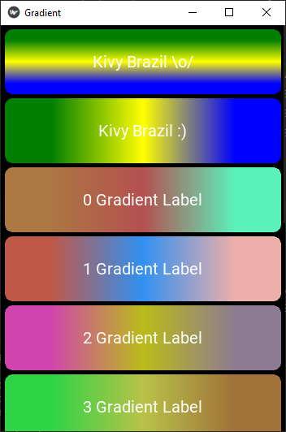
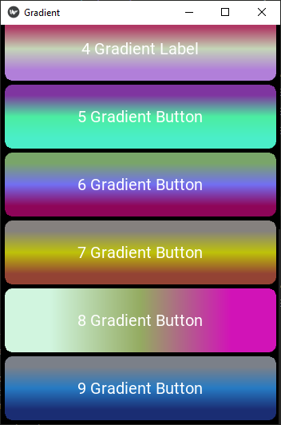

# kivy-gradient
Widgets Gradiente/Degradê para colorir nossos apps.

## Objetivo
É usado para:
- Colorir a aplicação com o mais modermo mundo do degradê.

## Exigências
```
python >= 3.7

kivy >= 1.11.1
```

## Como utilizar
```
py main.py

ou

python3 main.py
```

<p align="center">
  <a href="https://github.com/kivy-live-reloader">
    
  </a>
  <span> &nbsp&nbsp&nbsp </span>
  <a href="https://github.com/kivy-live-reloader">
    
  </a>
</p>
